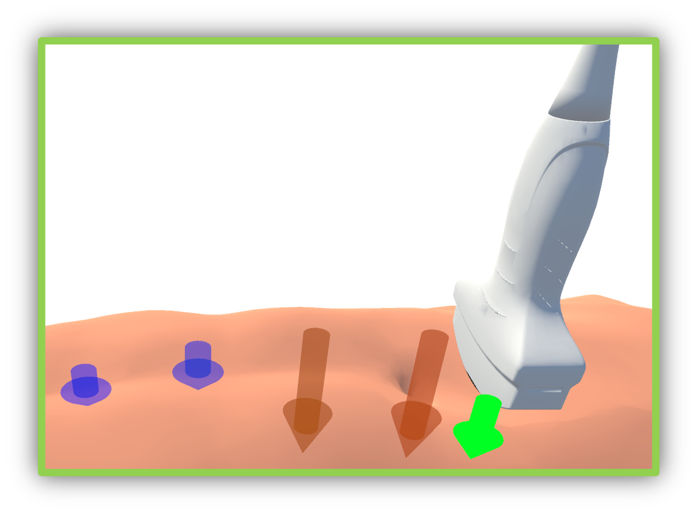
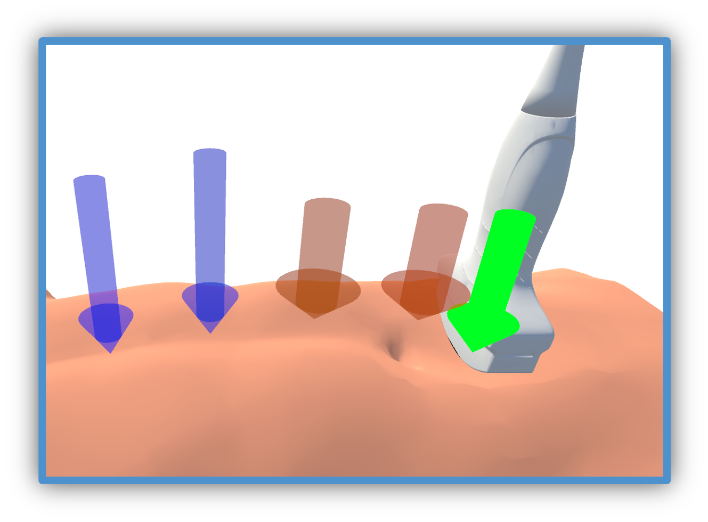
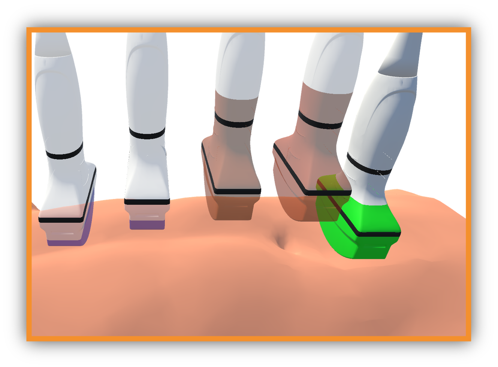
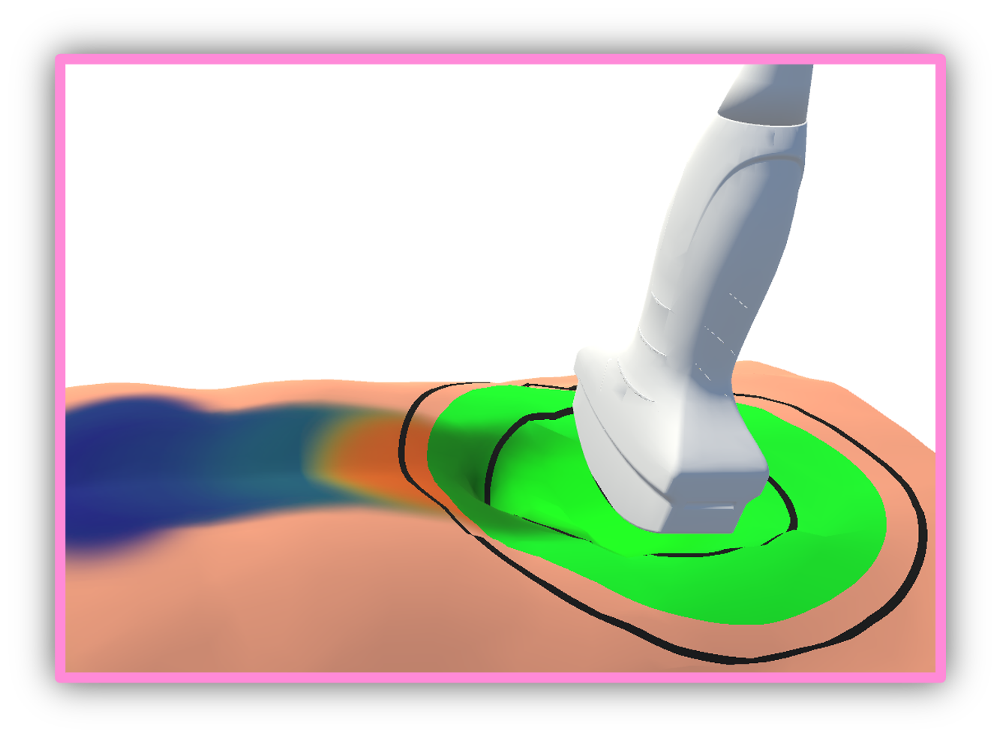

# Optimizing In-Contact Force Planning in Robotic Ultrasound with Augmented Reality Visualization Techniques

## Abstract
This paper investigates novel AR visualization techniques designed to depict in-contact force applied by a robotic ultrasound probe, aiming to optimize the control practitioners have over probe force for ultrasound procedures, thereby enhancing both image quality and patient comfort. We developed and evaluated four distinct AR visualization techniques through a comprehensive user study conducted in a clinical setting.

## Force Visualizations
We focus exclusively on the contact force normal to the contact surface, as it is critical for ensuring accurate imaging and minimizing tissue deformation during RUSS procedures. 
* **Vector Arrow** displays the forces using the vector arrows along the trajectory, illustrating the magnitude and direction of force at each point. 
* **Squeezable Arrow** visualizes the current force with a squeezable arrow inside the ultrasound probe. The forces at four control points along the trajectory are also depicted using this visualization.
* **Linear Gauge** presents force information directly on the ultrasound probe itself. To display the force at previous control points, ”ghost” images of past ultrasound probes are shown. 
* **Force Heatmap** illustrates the force being directly ”painted” on the surface of the patient’s body, with the force distribution
from previous positions painted along the trajectory.

<p align="center" width="100%">
    <table>
        <tr>
            <td align="center" width="45%">
                <br>
                Vector Arrow
            </td>
            <td align="center" width="45%">
                <br>
                Squeezable Arrow
            </td>
        </tr>
        <tr>
            <td align="center" width="45%">
                <br>
                Linear Gauge
            </td>
            <td align="center" width="45%">
                <br>
                Force Heatmap
            </td>
        </tr>
    </table>
</p>

## Differnece From the Paper
Due to licensing issues with some third-party plugins and libraries, we are unable to share certain components on GitHub. Specifically, the following plugins used in the original paper are not included in this repository:

- **Bio-IK**: The inverse kinematics solver for robot arm.
- **Obi Softbody**:  The particle-based physics engine for simualtion of body deformation and force.

Instead, we have created a minimal example scene that only contains the essential parts of our visualization techniques. This scene is designed to demonstrate the core feature and can be used as a starting point for further development. 

If you require these plugins for your work, please refer to the official sources for obtaining them.

## Cite Us

```
@inproceedings{song2024optimizing,
  title={Optimizing In-Contact Force Planning in Robotic Ultrasound with Augmented Reality Visualization Techniques},
  author={Song, Tianyu and Eck, Ulrich and Navab, Nassir},
  booktitle={2024 IEEE International Symposium on Mixed and Augmented Reality (ISMAR)},
  year={2024},
  organization={IEEE}
}
```
